# R Programming Language

# Introduction

**R Logical Data Type**

The R logical data type has two possible values - `TRUE` or `FALSE`.

It is important for the capitalization to stay as shown and to make sure not to wrap the values in quotes.

**NA Data Type in R**

R conveys an absence of value with the keyword NA (no quotes). There is a numeric NA, a character NA, and a logical NA. Each means a non value within its context.

**Mathematical Operations in R**

In R, the conventional symbols `+, -, *, and /` are used for addition, subtraction, multiplication, and division. The PEMDAS order of operations governs these mathematical operations in R.

### **R Logical Data Type**

The R logical data type has two possible values - `TRUE` or `FALSE`.

It is important for the capitalization to stay as shown and to make sure not to wrap the values in quotes.

### **NA Data Type in R**

R conveys an absence of value with the keyword NA (no quotes). There is a numeric NA, a character NA, and a logical NA. Each means a non value within its context.

### **Mathematical Operations in R**

In R, the conventional symbols `+, -, *, and /` are used for addition, subtraction, multiplication, and division. The PEMDAS order of operations governs these mathematical operations in R.

```r
# Results in "500"
573 - 74 + 1

# Results in "50"
25 * 2

# Results in "2"
10 / 5
```

### **R Data Types**

In R, and in programming in general, data types are the classifications that we give to different kinds of information pieces.

Specifically, R provides the following basic data types: character, numeric, integer, logical, and complex. Each data type is used to represent some type of info - numbers, strings, boolean values, etc.

```r
# var1 has the number data type
var1 <- 3

# var2 has the character data type
var2 <- "happiness"

# var3 has the logical data type
var3 <- TRUE 
```

### **R Conditional Statements**

In R, a conditional statement goes inside parentheses and is followed by a set of curly braces that contain the code to be executed.

In an if statement, if the conditional is True then the code inside the curly braces is executed.

```r
if (n == 5) {
  print('n is equal to five')
}
```

### **R Comments**

R interprets anything on a line after a `#` symbol as a comment.

Comments can be used to add text in the program that will NOT be executed. They are useful for providing context, hints for yourself or others working on the code, or even to temporarily get rid of a line when debugging.

```r
# This is a comment!
```

### **R’s Character Data Type**

R’s character data type includes all string values. A character is denoted by its surrounding quotation marks. Characters are any text or grouping of keyboard characters, including letters, numbers, spaces, symbols, etc. The character version of a number is the text conveying a number. The number itself, without quotes, is numeric.

### **Assignment Operator in R**

In R, there are two ways to assign values to variables. We can use the assignment operator, an arrow sign (`<-`) made with a carat and a dash. It is also acceptable, though less preferred, to use an equal sign (`=`).

### **R Numeric Data Type**

The numeric data type in R is a class that represents numbers that can be integers or decimals.

```r
example <- 4 
another.example <- 15.2
```

# **Basic Syntax and Variable Types**

### **Variable Types in R**

All objects in R have a variable type. The most common are:

- numeric: the object is a number
- character: the object contains letters
- logical: the object is either `TRUE` or `FALSE`
- `NA`: the object is blank (categorized as logical, but may be part of a character or numeric vector)

We can use the `class()` function on an object to check its variable type.

```r
class(2000) #numeric
class("apple") #character
class(NA) #logical
```

### **Basic Syntax in R**

R uses symbols to represent:

- math operations (`+`, ``, ``, and `/` and follows the order of operations)
- logical operators (`>`, `>=`,`<`, `<=`, `==`, and `!=`)
- joining logical operators (`&`, `&&`, `|` and `||`)
- object assignment (`<-` or `=`)

The names of objects in R must follow 3 rules:

1. No spaces
2. No symbols other than `.` or `_`
3. Names must begin with a letter

```r
## Order of operations
25+7/4 #26.75
(25+7)/4 #8

## AND vs OR
5 > 3 && 3 > 4 #FALSE
5 > 3 || 3 > 4 #TRUE
```

# Data Structures

### **R Data Frames**

A data frame is a spreadsheet-like R object that stores data in two dimensions represented by columns and rows. The columns are different variables of the data frame and the rows are the observations of each variable.

We can navigate data frames using either the `$` operator and specifying a column name, or by using `[r,c]` where `r` represents the row index and `c` represents the column index.

```r
# Initiate data frame
dat <- data.frame(
    x = c(1,1,1,1),
    y = c(2,2,2,2),
    z = c(3,3,3,3))

# Call column y
dat$y
dat[,2]

# Call row 3
dat[3,]

# Call row 1 column 3
dat[1,3]
```

### **R vectors**

A vector is a data structure that can hold multiple objects of the same data type. For example, `c(45, 25, 89, 10)` creates a numerical vector. To access elements, use the `[` `]` brackets with indexing starting from 1.

```r
my_string_vector <- c("this", "is", "an", "example", "vector")
my_string_vector[3] # returns "an"

my_boolean_vector <- c(TRUE, FALSE, FALSE)
my_numerical_vector <- c(0.4, 0.9, 1, 0.45, 1.2, 0.33)

# R will force the same type even if you input different types to c()
my_vector <- c("word", 45, 12, FALSE)
# result: a vector of strings "word" "45" "12" "FALSE" 
```

### **R Matrices**

In R, a matrix is a two-dimensional data structure that holds objects of the same type. To create one, use the `matrix()` function with a vector representing the data (R will interpret whether it is repeating or non-repeating), `nrow` equal to the number of rows, and `ncol` equal to the number of columns.

To access a single element inside a matrix called `ex_matrix`, you can look up the item in the `r`th row and the `c`th column like so: `ex_matrix[r, ]`.

To access the entire `r`th row, you can refer to it like so: `ex_matrix[r, c]`. To access the `c`th column, use `ex_matrix[ , c]`.

```r
# will create a 3-by-3 matrix with the vectors being filled column-wise (default)
my_matrix <- matrix(c("a", "b", "e", "k", "e", "w", "g", "x", "t"), nrow = 3, ncol = 3)
# result:
# "a" "k" "g"
# "b" "e" "x"
# "e" "w" "t"
single_element <- my_matrix[1, 3]
# returns "g"

second_row <- my_matrix[2,]
# returns: "b" "e" "x"
second_col <- my_matrix[,2]
# returns: "k" "e" "w"
```

### **R Lists**

In R, a list can store a variety of data types and data structures in a single variable. This means a list can hold individual strings and numbers, but also vectors and lists.

To access a single element, use `[[` `]]` double brackets. A list is useful for organization because you can name the elements inside it and select them using `$`

```r
my_list <- list("Elephant", FALSE, 900, 80.3, list("pencil", "pens"))
my_list[[4]] # returns 80.3

my_longer_list <- list(misc = my_list, notes = c("g", "b", "d", "g"))

my_longer_list[[1]]
# returns the contents of my_list
my_longer_list$misc
# returns the contents of my_list
my_longer_list$notes
# returns "g" "b" "d" "g"
```

# **Programming**

### **Functions in R**

A function is a collection of several lines of code. By calling the function’s name, we execute the code of the function. We can call the function with different input arguments, or parameters, to get different results. We can dictate what is given back when the function is complete using a `return()` statement.

```r
# Define a function
standardize <- function(data_vector) {
  # code to run
  standardized <- (data_vector - mean(data_vector))/sd(data_vector)
  
  # dictate what to return
  return(standardized)
}
```

### **apply() Functions in R**

We can use the `apply(X, MARGIN, FUN)` function to apply a function to all the elements in a data structure. `X` is the dataframe we want to apply the function to, `MARGIN` is where we specify whether to apply to rows (`1`) or columns (`2`), and `FUN` is the function to apply.

```r
## Get the mean of each column in dat
apply(X = dat, MARGIN = 2, FUN = mean)

## Get the max of each row in dat
apply(X = dat, MARGIN = 1, FUN = max)
```

### **Tibbles and dplyr**

Tibbles are a type of dataframe unique to the tidyverse. Tibbles can be manipulated using the 5 basic functions of the `dplyr` package:

- `mutate()`: add or adjust whole columns
- `select()`: specify which columns to keep or remove from a tibble
- `filter()`: specify which rows to keep or remove from a tibble
- `summarize()`: reduces one or more variables to a summary value
- `arrange()`: select the order of rows in a tibble by the values in a column

Multiple steps and functions can be connected together into a single step using the pipe `%>%` operator.

```r
tib %>% 
  # make a column for the averages of test1
  summarize(avg_test1 = mean(test1)) %>% 
  # add new columns test1_letter and test2_letter
  mutate(
    # assign test1_letter based on test1 average score
    test1_letter = case_when(
      avg_test1 < 80 ~ "C",
      avg_test1 >= 80 & avg_test1 < 90 ~ "B",
      avg_test1 >= 90 ~ "A")) %>% 
  # reorder the columns to be the average score and then letter
  select(avg_test1, test1_letter)
```

### **R Control Flow**

Control flow involves the program deciding which code to execute. The decision-making is established through conditional statements, i.e. `if`, `else if`, and `else`. Each condition should compute to a logical `TRUE` or `FALSE`. You can use comparison operators like `!`, `&` and `|` to combine logical values.

```r
if (condition_to_check) {
   # execute code and don't check any more conditions
} else if (other_condition_to_check & and_this_condition_to_check) {
   # execute code only if both are true and don't check any more conditions
} else if (either_this_condition | or_this_condition ) {
   # execute code if either condition is true and don't go to else
} else {
   # the default code if none of the conditions above are true
}
```

### **Loops in R**

A loop allows you to execute the same piece of code multiple times. Each execution is called an iteration. A **for loop** allows you to specify the number of iterations or go through a data structure’s length.

You can use the `loop_variable` inside the loop body but it only has meaning inside the loop.

A **while** loop on the other hand repeats code while a condition is true. You want the condition to start as true, and some value should be altered in the loop so that the condition becomes false at some point.```

```r
# how to define a for loop
for (loop_variable in sequence) {
    # code to repeat
}

# how to define a while loop
while (condition_to_check_every_iteration) {
    # code to repeat
}
```

# **Basic Data Analysis**

### **Summary Statistics in R**

Because R is mainly a statistical processing software, summary statistics come standard with base R functionality.

- Use `mean()` and `median()` to calculate average of a vector.
- Use `min()`, `max()`, and `range()` to see the range of a vector.
- Use `sd()` or `var()` to calculate the spread of a vector.
- Use `table()` to view the frequency of each value in a vector.

```r
## AVERAGE
mean(dat) #mean
median(dat) #median

## RANGE
min(dat) #minimum value
max(dat) #maximum value
range(dat) #minimum and maximum

## SPREAD
sd(dat) #standard deviation
var(dat) #variance

## FREQUENCY
table(dat) #frequency of each value
```

### **Creating Regression Models in R**

The `lm()` function creates a linear regression model in R. The `glm()` function creates a logistic regression model in R.

These functions take a formula `Y ~ X` where `Y` is the outcome variable and `X` is the predictor variable. We can add additional predictor variables using `+`.

A summary of these models can be printed using the `summary()` function.

```r
## Linear regression model
temp_lm <- lm(temp ~ month + region, data = world)
summary(temp_lm) #print summary

## Logistic regression model
winning_glm <- glm(win ~ ranking + home + starting_players, data = team)
summary(winning_glm) #print summary
```

### **Making Predictions from Regression Objects in R**

To make predictions of the outcome variable using a regression model, we need a dataset whose column names match the names of the coefficients in the model. Once establishing the data to make predictions about, we can use the `predict()` function to generate predictions. This will produce 1 predicted outcome for each observation in this new dataset.

```r
## Create linear regression model
lm1 <- lm(y ~ x1 + x2 + x3, data = dat)

## Establish data to make predictions about
pred_data <- data.frame(
  x1 = c(0, 1, -1), 
  x2 = c(1, 6, 5),
  x3 = c(10, -4, 9)
)

## Make predictions
predict(lm1, pred_data)
```

# Data Frames

### **dplyr package**

The dplyr package provides functions that perform data manipulation operations oriented to explore and manipulate datasets. At the most basic level, the package functions refers to data manipulation “verbs” such as select, filter, mutate, arrange, summarize among others that allow to chain multiple steps in a few lines of code. The dplyr package is suitable to work with a single dataset as well as to achieve complex results in large datasets.

### **Loading and Saving CSVs with R**

The `read_csv()` and `write_csv()` functions belong to the tidyverse package and perform smart reading and writing operations of files in R. The `read_csv()` function reads a file and converts it to a better format of a data frame called a tibble.  The first argument of the `read_csv()` is the file to be read.  Tibbles in R can be exported to csv files using the `write_csv()` function. The first argument of `write_csv()` is the tibble to be exported.

### **filter with logical operators**

The filter() function can subset rows of a data frame based on logical operations of certain columns. The condition of the filter should be explicity passed as a parameter of the function with the following syntax: name of the column, operator(<,==,>,!=) and value. On the other hand is possible to chain conditions within a column or on different columns using logical operators such as boolean operators(&,|,!).

### **data frame object**

A data frame is an R object that store data in two dimensions represented by columns and rows. The columns are the different variables of the dataframe and the rows are the observations of each variable. Each row of the dataframe represent a unique set of observations. This object is a useful data tructure to store data with different types in columns and perform analysis around them.

### **Excluding Columns with select() in Dplyr**

The select() function of dplyr allows users to select all columns of the data frame except for the specified columns. To exclude columns, add the `-` operator before the name of the column or columns when passing them as an arguments to select(). This will return a new data frame with all columns except ones preceded by a `-` operator.  For example: `select(-genre, -spotify_monthly_listeners, -year_founded)`.

### **rename-dplyr**

The `rename()` function of *dplyr* package can be used to change the column names of a data frame. It has a simple syntax where it is necessary to pass the new name followed by the `=` operator and the old name of the column. On the other hand to rename multiple columns based on logical criteria, the `rename()` function has variants such as `rename_if()`, `rename_at()` and `rename_all()`.

### **Dplyr’s filter()**

The `filter()` function of the dplyr package allows users to select a subset of rows in a data frame that match with certain conditions that are passed as 
arguments. The first argument of the function is the data frame and the following arguments are the conditional expressions that serve as the `filter()` criteria.  For example: `filter(artists, genre == 'Rock', spotify_monthly_listeners > 20000000)`.

### **data frames primary information**

Data frames in R can be inspected using `head()` and `summary()`. The `head()` function accepts an integer argument which determines the number of 
rows of the data frame that you can see. The default value of the `head()` function is 6. The `summary()` returns summary statistics such as min, max, mean, and three quartiles.

### **dplyr arrange()**

The `arrange()` function of the dplyr package orders the rows of a data frame based on the values of a column or a set of columns that are passed as 
parameters. The resulting order of the data frame can be in ascending or descending order. By default `arrange()` orders the dataframe in ascending order, but it is possible to change this and order the data frame in descending order using the `desc()` parameter over the column.

### **mutate() dplyr**

The `mutate()`
 function from dplyr package adds new columns to an existing data frame based on a transformation of an existing column, while maintaining all the other columns. The function receives the data frame as the first parameter, and subsequently specify the new column name followed by the `=` operator and a transformation function. After the first variable parameter, further parameters can be added to mutate more variables at the same time.

```r
mutate(heights, cm = inches * 0.39)
```

### **Comma Separated Values (CSV)**

CSV (Comma-separated values) files represent plain text in the form of a spreadsheet that use comma to separate individual values. This type of file is easy to manage and compatible with many different platforms. This file can be imported to a database or to an Integrated Development Environment (IDE) to work with its content.

### **pipes**

The pipe `%>%` can be used to input a value or an object into the first argument of a function. Instead of passing the argument into the function seperately, 
it is possible to write the value or object and then use the pipe to convert it as the function argument in the same line. This can be used with the functions *select()* and *filter()* that contain a data frame as the first argument.In the example, the weather data frame is piped into the select function that would select the first two columns of the weather data frame.

```r
weather %>% select(1:2) 
```

### **transmute() dplyr**

The `transmute()` function, from dpylr, creates new columns from a data frame by transforming existing ones. The result of the function is the new column while all the original columns are removed in the new data frame. The function receives the data frame as the first argument, and the new 
variable name with the function to transform it as the second parameter. It is possible to perform multiple transformations in the same line, by specifying each individual transformation.

```r
transmute(population, increase = total_population/lag(total_population))
```

### **Dplyr’s select()**

The `select()` function of dplyr package is used to choose which columns of a data frame you would like to work with. It takes column names as arguments and creates a new data frame using the selected columns.  `select()` can be combined with others functions such as `filter()`.

# Data Cleaning

### **gsub() R Function**

The base R `gsub()` function searches for a regular expression in a string and replaces it. The function recieve a string or character to replace, a replacement value, and the object that contains the regular expression. We can use it to replace substrings within a single string or in each string in a 
vector. When combined with dplyr’s `mutate()` function, a column of a data frame can be cleaned to enable analysis.

```r
# Replace the element "1" with the empty string in the teams vector in order to get the teams_clean vector with the correct names.
teams <- c("Fal1cons", "Cardinals", "Seah1awks", "Vikings", "Bro1nco", "Patrio1ts") 

teams_clean <- gsub("1", "", teams)

print(teams_clean)

# Output:
# "Falcons" "Cardinals" "Seahawks" "Vikings" "Bronco" "Patriots"
```

### **distinct() dplyr**

The `distinct()` function from dplyr package is used to keep only unique rows on a data frame. If there are duplicate rows, the function will preserve only the first row. The function can be used to remove equal rows of a dataframe, and to remove rows in a data frame based on unique column values or 
unique combination of columns values.

```r
# Keep unique rows in the match_statistics  data frame
distinct(match_statistics)

# Keep only rows with different values in the prices column of trips
# dataframe
distinct(trips,prices)
```

### **str() Function**

The `str()` function display the internal *structure* of an R object that is passed as parameter of the function. The function outputs the data structure of the object as well as the elements of the object. When the object is a dataframe, the function returns the data type of each column in the data frame, the number of observations and the number and variables.

### **Combing Data with R**

Data from multiple files can be combined into one data frame using the base R functions `list.files()` and `lappy()`, with readr’s `read_csv()` and dplyr’s `bind_rows()` functions. Consider the following steps:

1. *Get the list of files*. The following code will get a list of all files in the current directory that match the pattern “file_.*csv” 

```r
files <- list.files(pattern = "file_.*csv")
```

1. *Read in the files*. The following code applies `read_csv()`, a function from readr, to each file, and adds the resulting data frames to the list `df_list`.

```r
df_list <- lapply(files, read_csv)
```

1. *Combine the file data*. Below `bind_rows()`, a dplyr function, is used to combine the data from each data frame in the list into one data frame.

```r
df <- bind_rows(df_list)
```

### **R as.numeric() Function**

The base R `as.numeric()` function can coerce character string objects into numeric types.

This function is useful because often numbers are stored as characters which do not allow operations or analysis. The function receives the object to be transformed as a parameter and transforms it to numeric.

When this function is combined with the `mutate()` function from dplyr, new columns of a dataframe can be created with the numeric data type.

### **str_sub() function**

The `str_sub()`
 function from the stringr package can split a string by index position 
separating combined data values into their individual components. The 
function uses the `start=` and `end=` arguments to perform the split operation. This function can be used with `mutate()` from dplyr in order to generate multiple new columns on a data frame based on split string values of a particular column.

```r
# This command would take the first index to the five index of the string.
str_sub('Marya1984', start=1,end=5)
```

### **Tidy Dataset**

In a tidy dataset each variable is represented by a column, and each row is a separate observation. Tidy datasets are the best way to conduct data analysis on specific data. By adhering to the standard of a tidy dataset, it is easier for an analyst to extract from. Datasets that are not tidy present some issues in their structure such as one column storing multiple variables, the same information of a variable is spread out in multiple columns, or the variables can be stored in both rows and columns.

### **The `dplyr` and `tidyr` packages**

The `dplyr` and `tidyr` packages provide functions that solve common data cleaning challenges in R.

Data cleaning and preparation should be performed on a “messy” dataset before any analysis can occur. This process can include:

- diagnosing the “tidiness” of the data
- reshaping the data
- combining multiple files of data
- changing the data types of values
- manipulating strings to better represent the data

### **separate() Function**

The `separate()` function from the tidyr package, is used to separate a single character column of a data frame into multiple columns. Arguments of this 
function are, in order, a dataframe, the column used to create the new columns(column name or column position in the data frame), the new column names that will be used, and the separator argument. The default seperator will match any non-alphanumeric sequence, such as a space or semicolon.

```r
# This function would separate the complete_name column into new columns called names and surnames on the individuals data frame.
separate(individuals, complete_name, c("names","surnames"))
```

### **gather() tidyr**

The `gather()` function from tidyr package is useful to gather columns over a data frame into key-value pairs, changing the shape of a data frame from wide to long. The original data frame has multiple columns that can be gathered, in a unique structure of key-value pair with all values in one column and the column names in another column.

# **Fundamentals of Data Visualization with ggplot2**

### **Grammar of Graphics with ggplot2**

ggplot2 uses the basic units of the “grammar of graphics” to construct data visualizations in a layered approach.

The basic units in the “grammar of graphics” consist of:

- The *data* or the actual information that is to be visualized.
- The *geometries*, shortened to “geoms”, which describe the shapes that represent the data. These shapes can be dots on a scatter plot, bar charts on the graph, or a line to plot the data. Data are mapped to geoms.
- The *aesthetics*, or the visual attributes of the plot, including the scales on the axes, the color, the fill, and other attributes concerning appearance.

Visualizations in ggplot2 begin with a blank canvas, which is just an empty plot with data associated to it. Geoms are “added” as *layers* to the original canvas, adding representations of the data to the visualization.


In the visual above:

- The first line declares the *data* that will be used in the plot (`mtcars`) and creates the *aesthetic* mapping of `wt` to `mpg`.
- The second line creates the data point *geom* layer.
- The third line creates the smoothed *geom* layer.

The key is that the `aes()` (*aesthetic* function) on line one maps the data onto each of the two geom layers

### **Geom Aesthetics**

In ggplot2 geom aesthetics are data-driven instructions that determine the visual properties of an individual geom.

Geom aesthetics allow individual layers of a visualization to have their own aesthetic mappings. These aesthetic mappings can vary depending on the geom.

For example, the `geom_point()` geom can color-code the data points on a scatterplot based on a property with the following code:

```r
viz <- ggplot(data=airquality, aes(x=Ozone, y=Temp)) +
       geom_point(aes(color=Month)) + 
       geom_smooth()
```

The code above would *only* change the color of the point layer, it would not affect the color of the smooth layer since the `aes()` aesthetic mapping is passed at the point layer. 

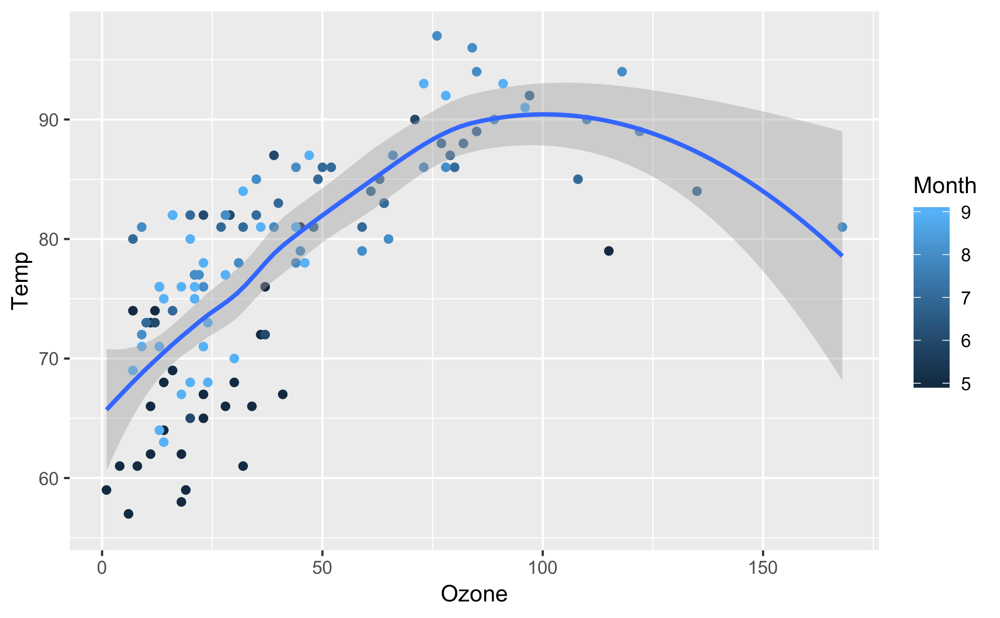

### **ggplot2 Aesthetics**

In ggplot2 aesthetics are the instructions that determine the visual properties of a plot and its geometries.

Examples of ggplot2 aesthetics include:

- scales for the x and y axes
- color of the data points on the plot based on a property or on a color preference
- the size or shape of different geometries

Aesthetics are set either manually or by *aesthetic mappings*. Aesthetic mappings “map” variables from the bound data frame to visual properties in the plot. These mappings are provided in two ways using the `aes()` mapping function:

1. At the canvas level: All subsequent layers on the canvas will inherit the aesthetic mappings defined when the ggplot object was created with `ggplot()`.
2. At the geom level: Only that layer will use the aesthetic mappings provided.

For example, the following code assigns `aes()` mappings for the `x` and `y` scales at the canvas level:

```r
viz <- ggplot(data=airquality, aes(x=Ozone, y=Temp)) +
       geom_point() + 
       geom_smooth()
```

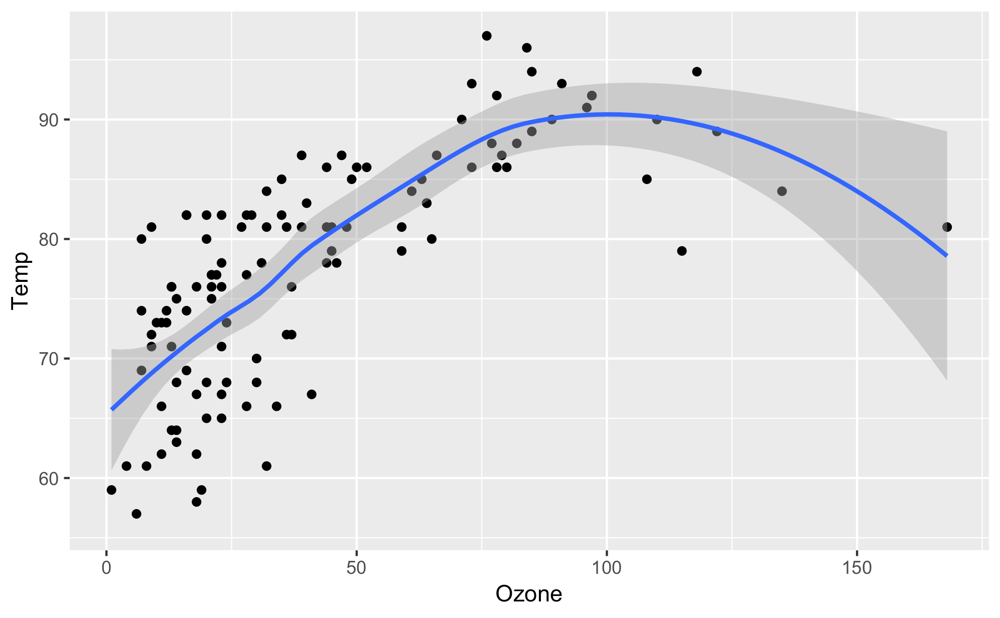

In the example above:

- The aesthetic mapping is wrapped in the `aes()` aesthetic mapping function as an additional argument to `ggplot()`.
- Both of the subsequent geom layers, `geom_point()` and `geom_smooth()` use the scales defined inside the aesthetic mapping assigned at the canvas level.

You could create the same plot by setting the aesthetics at the geom level, as follows:

```r
viz <- ggplot(data=airquality) +
  geom_point(aes(x=Ozone, y=Temp)) +
  geom_smooth(aes(x=Ozone, y=Temp))
```

### **ggplot2 Labels**

In ggplot2, *labels* add meaning and clarity to a data visualization. ggplot2 automatically assigns the name of the variable corresponding to components, like axes labels. Because data frame variable names are not always legible to outside readers, the `labs()` function allows you to manually set labels.

To customize a plot’s labels, add a `labs()` function call to the ggplot object. Inside the function call to `labs()`, you can provide labels for the `x` and `y` axes as well as a `title`, `subtitle`, or `caption`. The list of available label arguments can be found in the [`labs()` documentation](https://ggplot2.tidyverse.org/reference/labs.html).

The following `labs()` function call and these specified arguments would render the following plot:

```r
viz <- ggplot(df, aes(x=rent, y=size_sqft)) + 
       geom_point() +
       labs(title="Monthly Rent vs Apartment Size in Brooklyn, NY", subtitle="Data by StreetEasy (2017)", x="Monthly Rent ($)", y="Apartment Size (sq ft.)")
viz
```

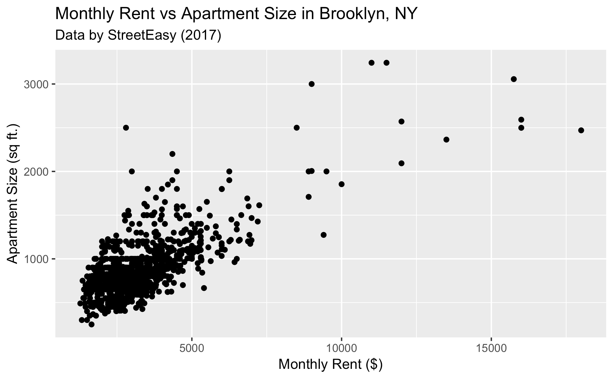

### **ggplot() Initializes a ggplot Object**

Invoking the `ggplot()` function returns an object that serves as the base of a ggplot2 visualization.

```r
viz <- ggplot()
viz # renders blank plot
```

Data is bound to a ggplot2 visualization by passing a data frame as the first argument in the `ggplot()` function call. Layers can be added to the plot object by adding function calls after `ggplot()` with a `+` plus sign. These functions have access to the data frame and can use the column names as variables.

For example, consider a data frame `sales` with the columns `cost` and `profit`. To assign the data frame `sales` to the `ggplot()` object that is initialized:

```r
viz <- ggplot(data=sales) +
       geom_point(aes(x=cost, y=profit))
viz # renders plot
```

In the example above:

- The ggplot object or canvas was initialized with the data frame `sales` assigned to it
- The subsequent `geom_point` layer used the `cost` and `profit` columns to define the scales of the axes for that particular geom.
Notice that it referred to those columns with their column names.
- The variable name of the ggplot object is stated so the plot is viewable.

### **ggplot2 Bar Chart**

The `geom_bar()` layer adds a bar chart to a ggplot2 canvas.

Typically when creating a bar chart, an `aes()` aesthetic mapping with a single categorical value on the `x` axes and the `aes()` function will compute the count for each category and display the count values on the `y` axis.

To create a bar chart displaying the number of books in each `Language` from a `books` data frame :

```r
bar <- ggplot(books, aes(x=Language)) + geom_bar()
bar
```

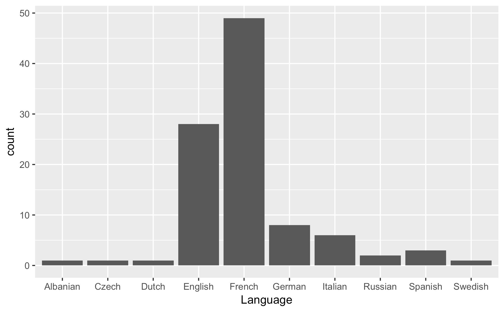

# Aggregates

### **group_by() with mutate()**

Combining `dplyr`‘s `group_by()` and `mutate()` functions allows for the creation of new variables that involve per-group metrics in their calculation.

Grouping a data frame by a selection of columns followed by a call to `mutate()` allows for the creation of new columns based on per-group summary functions.

Given a `students` data frame, to add a new column containing the difference between a student’s score and the mean `math_score` for each student’s respective age group:

```r
students %>%
  group_by(age) %>%
  mutate(diff_from_age_mean = math_score - mean(math_score, na.rm = TRUE))
```

- `group_by()` groups the data frame by `age`
- `mutate()` will add a new column `diff_from_age_mean` which is calculated as the difference between a row’s individual `math_score` and the `mean(math_score)` for that row’s age-group

### **dplyr group_by()**

`dplyr`‘s `group_by()` function can group together rows of a data frame with the same value(s) in either a specified column or multiple columns, allowing for the application of summary functions on the individual groups.

`group_by()` changes the unit of analysis from a complete dataset to individual groups.

For example, consider a data frame `countries`. To find the mean and standard deviation of the `population` column grouped by `continent`:

```r
countries %>%
  group_by(continent) %>%
  summarise(mean_pop = mean(population, na.rm = TRUE),
                      sd_pop = sd(population, na.rm = TRUE))
```

To find the mean `math_score` and `reading_score` by `age` and `gender` from a `students` data frame:

```r
students %>%
  group_by(age, gender) %>%
  summarise(mean_math_score = mean(math_score, na.rm = TRUE),
                      mean_reading_score = mean(reading_score, na.rm = TRUE))
```

### **filter() with group_by()**

Combining `dplyr`‘s `group_by()` and `filter()` functions allows for the filtering of rows of a data frame based on per-group metrics.

Grouping a data frame by a selection of columns followed by a call to `filter()` allows for filtering a data frame based on per-group summary functions.

Given a `students` data frame, to keep all the rows of `students` whose per-age average `math_score` is less than `80`:

```r
students %>%
  group_by(age) %>%
  filter(mean(math_score, na.rm = TRUE) > 80)
```

- `group_by()` groups the data frame by `age`
- `filter()` will keep all the rows of the data frame whose per-group (per-age) average `math_score` is greater than `80`

### **dplyr summarise()**

`dplyr`‘s `summarise()` function can collapse a data frame to a single row, summarising the specified columns by applying a summary function.

Summary functions, or functions that take a vector of values and return a single value, include: `mean()`, `median()`, `sd()` (standard deviation), `var()` (variance), `min()`, `max()`, `IQR()` (interquartile range), `n_distinct()` (number of unique values), and `sum()`.

For example, to find the mean `population` and `gdp` from `countries` data frame:

```r
countries %>%
  summarise(mean_pop = mean(population, na.rm = TRUE))
```

To find the mean and standard deviation of both the `population` and `gdp` columns from a `countries` data frame:

```r
countries %>%
  summarise(mean_pop = mean(population, na.rm = TRUE),
                      sd_pop = sd(population, na.rm = TRUE),
                      mean_gdp = mean(gdp, na.rm = TRUE),
                      sd_gdp = sd(gdp, na.rm = TRUE))
```

### **dplyr package**

The dplyr package provides functions that perform data manipulation operations oriented to explore and manipulate datasets. At the most basic level, the package functions refers to data manipulation “verbs” such as select, filter, mutate, arrange, summarize among others that allow to chain multiple steps in a few lines of code. The dplyr package is suitable to work with a single dataset as well as to achieve complex results in large datasets.

# Joining Tables

### **dplyr inner_join()**

R data frame objects can be joined together with the `dplyr` function `inner_join()`. Corresponding rows with a matching column value in each data frame are combined into one row of a new data frame, and non-matching rows are dropped.

`dplyr`‘s `inner_join()` takes two data frames as arguments and returns a new data frame with the corresponding rows merged together. Non-matching rows from each data frame are dropped in the resulting data frame.

For example, consider the `sales` and `targets` data frames of a t-shirt company. `sales` contains the monthly revenue for the company and has two columns: `month` and `revenue`. `targets` contains the goals for monthly revenue for each month and has two columns: `month` and `target`. To perform an inner join on the two data frames using `dplyr`:

```r
sales_vs_targets <- sales %>%
  inner_join(targets)
```

`inner_join()` will use the `month` column as the column to match on, as both the `sales` and `target` data frames have a `month` column. The resultant data frame will only contain the matching rows from `sales` and `targets`.

Multiple data frames can be merged together at once by stringing multiple calls to `inner_join` with the pipe `%>%`.

For example, consider the same `sales` and `targets` data frames of a t-shirt company. An additional data frame `small_medium_large` contains the number of small, medium and large t-shirts sold per month and has four columns: `month`, `small`, `medium`, and `large`. To perform an inner join on the three data frames using `dplyr`:

```r
sales_vs_targets <- sales %>%
  inner_join(targets) %>%
  inner_join(small_medium_large)
```

`inner_join()` will use the `month` column as the column to match on, as the `sales`, `target`, and `small_medium_large` data frames have a `month` column. The resultant data frame will only contain the matching rows from `sales`, `targets`, and `small_medium_large`.

### **dplyr full_join()**

In a full join, R data frame objects are merged together with the `dplyr` function `full_join()`. Corresponding rows with a matching column value in each data frame are combined into one row of a new data frame, and non-matching rows are also added to the resultant data frame with `NA`s for the missing information.

`dplyr`‘s `full_join()` function will perform a full join, where non-matching rows are also added to the resultant merged data frame with `NA`s for the missing information.

For example, consider the inventory data frames of two stores, `store_a_inventory` and `store_b_inventory`. The `store_a_inventory` data frame contains two columns: `item` and `store_a_inventory`. The `store_b_inventory` data frame contains two columns: `item` and `store_b_inventory`. To perform a full join on the two data frames:

```r
store_a_b_inventory <- store_a_inventory %>%
  full_join(store_b_inventory)
```

The resultant data frame will contain each matching row from `store_a_inventory` and `store_b_inventory` as well as the non-matching rows from `store_a_inventory` and `store_b_inventory`.

### **dplyr bind_rows()**

Multiple R data frames containing the same columns can be concatenated into one data frame using the `dplyr` function `bind_rows()`.

`dplyr`‘s `bind_rows()` function takes all the data frames to bind as arguments and returns a single data frame where the data frames have been concatenated into a longer data frame.

For example, consider two customer data frames `customer_1` and  `customer_2`, each containing columns `name` and `email`. To concatenate the data frames into one longer data frame:

```r
customers <- customer_1 %>%
  bind_rows(customer_2)
```

If a third data frame `customer_3` with columns `name` and `email` also existed, all three data frames could be concatenated into one longer data frame as follows:

```r
customers <- customer_1 %>%
  bind_rows(customer_2) %>%
  bind_rows(customer_3)
```

### **dplyr join functions**

R data frames can be joined on specific columns using one of the `dplyr` join functions and the `by` argument.

The `dplyr` join functions can take the additional `by` argument, which indicates the columns in the “left” and “right” data frames of a join to match on.

For example, consider the `orders` and `products` data frames of a business. The `orders` data frame contains five columns: `id`, `product_id`, `customer_id`,`quantity` and `timestamp`. The `products` data frame contains three columns: `id`, `product_id`, and `price`. To perform an inner join on the two data frames using `product_id` from the `orders` data frame and `id` from the `products` data frame as the columns to join on:

```
orders_products <- orders %>%
  inner_join(products,
                    by = c("product_id" = "id")
                    suffix = c("_orders", "_products"))
```

The `suffix` argument will append suffixes to column names that duplicate between the two data frames. `id` in the original `orders` data frame will become `id_orders` in the resultant data frame and `id` in the original `products` data frame will become `id_products` in the resultant data frame.

**Efficient Data Storage with Multiple Tables**

For efficient data storage, related information is often spread across multiple tables of a database.

Consider an e-commerce business that tracks the products that have been ordered from its website. Business data for the company could be split into three tables:

- `orders` would contain the information necessary to describe an order: `order_id`, `customer_id`, `product_id`, `quantity`, and `timestamp`
- `products` would contain the information to describe each product: `product_id`, `product_description` and `product_price`
- `customers` would contain the information for each customer: `customer_id`, `customer_name`, `customer_address`, and `customer_phone_number`

This table structure prevents the storage of redundant information, given that each customer’s and product’s information is only stored once, rather than each time a customer places an order for another item.

# Mean, Median, and Mode

### **Median of a Dataset**

The median of a dataset is the value that, assuming the dataset is ordered from smallest to largest, falls in the middle. If there are an even number of values in a dataset, the middle two values are the median.

Say we have a dataset with the following ten numbers:

```
24, 16, 30, 10, 12, 28, 38, 2, 4, 36
```

We can order this dataset from smallest to largest:

```
2, 4, 10, 12, 16, 24, 28, 30, 36, 38
```

The medians of this dataset are 16 and 24, because they are the fifth- and sixth-positioned observations in this dataset. In other words, there are four observations to the left of 16, and four observations to the right of 24.

---

If we added another value (say, 28) near the middle of this dataset:

```
2, 4, 10, 12, 16, 24, 28, 28, 30, 36, 38
```

The new median is equal to 24, because there are 5 values smaller than it, and 5 values larger than it.

### **The median() Function in R**

In R, the median of a vector is calculated using the `median()` function. The function accepts a vector as an input. If there are an odd number of values in the vector, the function returns the middle value.  If there are an even number of values in the vector, the function returns the average of the two medians.

Even:

```
b <- c(3,4,5,6,12)
median(b)
```

The code above outputs `5` as the median, because it is the middle number in the array.

Odd:

```
a <- c(3,4,5,12)
median(a)
```

The code above outputs `4.5`, because it takes the average of the two medians, `4` and `5`.

### **Mean of a Dataset**

The *mean*, or average, of a dataset is calculated by adding all the values in the dataset and then dividing by the number of values in the set.

For example, for the dataset `[1,2,3]`, the mean is `1+2+3` / `3` = `2`.

### **The mode() Function in R**

In R, the mode of a vector can be calculated using the `Mode()` function in the `DescTools` package. The function accepts a vector as an input and returns the most frequently occurring observation in the dataset.

### One Mode

```r
library(DescTools)
example_data <- c(24, 16, 12, 10, 12, 28, 38, 12, 28, 24)
example_mode <- Mode(example_data)
```

The code above calculates the mode of the values in `example_data` and saves it to `example_mode`.

The result of `Mode()` is a vector with the mode value:

```r
>>> example_mode
[1] 12
```

### Two Modes

If there are multiple modes, the `Mode()` function will return them as a vector.

Let’s look at a vector with two modes, `12` and `24`:

```r
example_data = c(24, 16, 12, 10, 12, 24, 38, 12, 28, 24)
example_mode = Mode(example_data)
```

The result is:

```r
>>> example_mode
[1] 12 24
```

### **The mean() Function**

In R, the mean of a vector is calculated using the `mean()` function. The function accepts a vector as input, and returns the average as a numeric.

The code below is used to create a vector and calculate its mean:

```r
a <- c(3,4,5,6)
mean(a)
```

This code outputs the average value of the array `c(3,4,5,6)`:

```r
4.5
```

# Variance and Standard Deviation

### **Standard Deviation**

The standard deviation is a measure of a dataset’s spread. It is calculated by taking the square root of the variance of a data set. The resulting 
value has the same units as the original data.

### **Standard Deviation Units**

Because standard deviation is in the same units as the original data set, it is often used to provide context for the mean of the dataset. For example, if the data set is `[3, 5, 10, 14]`, the standard deviation is `4.301` units, and the mean is `8.0` units. By using the standard deviation, we can fairly easily see that the data point `14` is more than one standard deviation away from the mean.

### **Interpretation of Variance**

A larger variance means the data is more spread out and values tend to be far away from the mean. A variance of 0 means all values in the dataset are the same.

### **Variance**

Variance is a measure of spread. It is calculated by finding the average of the squared differences between every observation and the mean. The resulting value is in units squared.

# **Quartiles, Quantiles, and Interquartile Range**

### **Quantiles**

Quantiles are the set of values/points that divides the dataset into groups of equal size. For example, in the figure, there are nine values that splits the dataset. Those nine values are quantiles.

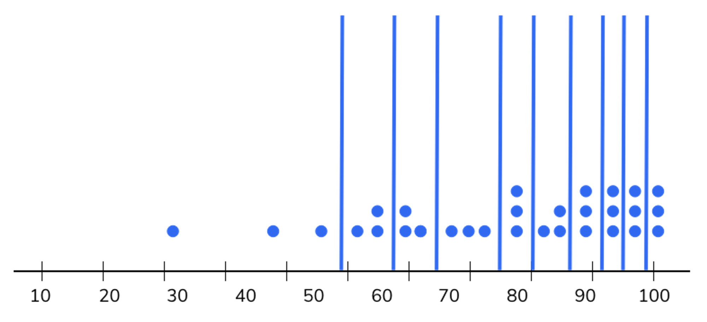

### **Quantiles and Groups**

If the number of quantiles is n, then the number of equally sized groups in a dataset is n+1.

### **Quartiles**

The three dividing points (or quantiles) that split data into four equally sized groups are called quartiles. For example, in the figure, the three dividing points Q1, Q2, Q3 are quartiles.

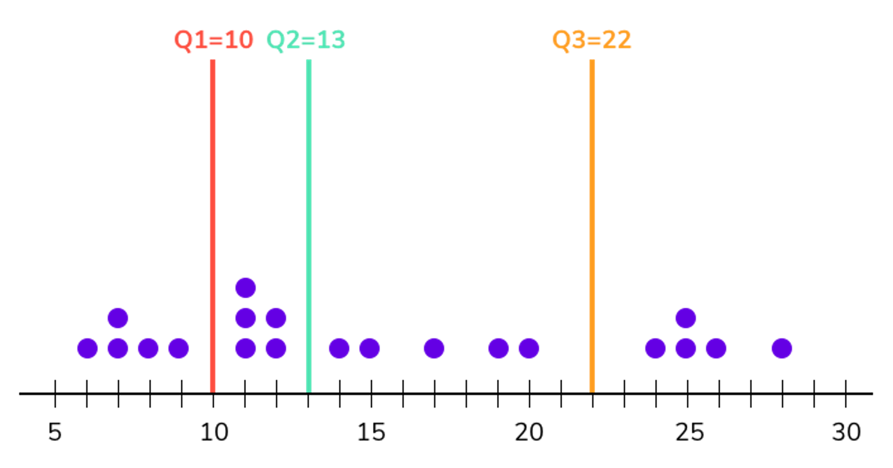

### **Median in Quantiles**

The median is the divider between the upper and lower halves of a dataset. It is the 50%, 0.5 quantile, also known as the 2-quantile.

```r
# The value 5 is both the median and the 2-quantile

data = [1, 3, 5, 9, 20]
Second_quantile = 5
```

### **Interquartile Range Definition**

The interquartile range is the difference between the first(Q1) and third quartiles(Q3). It can be mathematically represented as `IQR = Q3 - Q1`.

### **Interquartile Range and Outliers**

The interquartile range is considered to be a robust statistic because it is not distorted by outliers like the average (or mean).

```r
# Eventhough d_2 has an outlier, the IQR is identical for the 2 datasets 

d_1 = [1,2,3,4,5,6,7,8,9]
d_2 = [-100,2,3,4,5,6,7,8,9]
```

# **Hypothesis Testing**

### **Sample Vs. Population Mean**

In statistics, we often use the mean of a sample to estimate or infer the mean of the broader population from which the *sample* was taken. In other words, the *sample mean* is an estimation of the *population mean*.

### **Hypothesis Test P-value**

Statistical *hypothesis tests* return a *p-value*, which indicates the probability that the *null hypothesis* of a test is true. If the p-value is less than or equal to the *significance level*, then the null hypothesis is rejected in favor of the alternative hypothesis. And, if the p-value is greater than the significance level, 
then the null hypothesis is not rejected.

### **Hypothesis Test Errors**

*Type I* errors, also known as *false positives*, is the error of rejecting a null hypothesis when it is actually true. This can be viewed as a miss being registered as a hit. The acceptable rate of this type of error is called *significance level* and is usually set to be `0.05` (5%) or `0.01` (1%).

*Type II* errors, also known as *false negatives*, is the error of not rejecting a null hypothesis when the alternative hypothesis is the true. This can be viewed as a hit being registered as a miss.

Depending on the purpose of testing, testers decide which type of error to be concerned. But, usually `type I` error is more important than `type II`.

### **Central Limit Theorem**

The *central limit theorem* states that as samples of larger size are collected from a population, the distribution of sample means approaches a normal distribution with the same mean as the population. No matter the distribution of the population (uniform, binomial, etc), the sampling distribution of the 
mean will approximate a normal distribution and its mean is the same as the population mean.

The central limit theorem allows us to perform tests, make inferences, and solve problems using the normal distribution, even when the population is not normally distributed.

# **Linear Regression In R**

### **The Steps of Statistical Model Building**

The four primary steps of statistical model building are:

1. Confirming data assumptions
2. Building a model on training data
3. Assessing the model’s fit
4. Analyzing model results.

### **Linear Model Assumptions: Linearity**

When creating a linear regression model, one of the data assumptions is that the data is linear.

This can be tested visually by creating a scatter plot.

It can also be tested by calculating the correlation coefficient. A correlation coefficient near `0` suggests a weak linear relationship. A correlation coefficient near `1` or `-1` suggests a strong linear relationship.

To calculate the correlation coefficient in R, call the `cor.test()` function using two feature columns as parameters.

```r
# This finds the correlation coefficient between the TV and Sales columns of the data frame named advertising.
coefficient <- cor.test(advertising$TV, advertising$Sales)
coefficient$estimate
```

### **Linear Model Assumptions: Outliers**

When creating a linear regression model, one of the data assumptions is that the data has no extreme values that are not representative of the actual relationship between the two variables.

We can visualize outliers of a feature by creating a boxplot.

```r
# This will create a box plot of the sales column from a data frame named advertising
plot <- advertising %>%
  ggplot(aes(sales, sales)) +
  geom_boxplot()
```

### **Creating A Linear Regression Model In R**

The `lm()` function creates a linear regression model in R. This function takes an R formula `Y ~ X` where `Y` is the outcome variable and `X` is the predictor variable.

To create a multiple linear regression model in R, add additional predictor variables using `+`.

```r
# This creates a simple linear regression model where sales is the outcome variable and podcast is the predictor variable. The data used is a data frame named train.
model <- lm(sales ~ podcast, data = train)

# This creates a multiple linear regression model where the predictor variables are podcast and TV.
model2 <- lm(sales ~ podcast + TV, data = train)
```

### **Assessing Fit Of A Linear Regression Model: RSE**

Residual Standard Error (RSE) provides an absolute measure of lack of fit of a linear regression model to the data. Because it is measured in the units
 of the outcome variable, it is not always clear what RSE value constitutes a strongly fitted model.

For example, if we create a model that was trying to predict the amount of money earned by sales based on TV advertisements, RSE would be measured in dollars (the units of the outcome variable).

In R, the RSE of a linear regression model can be found by calling the `summary()` function using the model as a parameter. It can also be found by calling the `sigma()` function using the model as a parameter.

```r
# RSE can be found in the summary of a model.
summary(model)

# This will also return the RSE of a model.
sigma(model)
```

### **Assessing Fit Of A Linear Regression Model: R Squared**

A linear regression model’s R Squared value describes the proportion of variance explained by the model.

A value of  `1` means that all of the variance in the data is explained by the model, and the model fits the data well. A value of `0` means that none of the variance is explained by the model.

In R, the R Squared value of a linear regression model can be found by calling the `summary()` function using the model as a parameter.

```r
# This finds the R Squared value of a linear regression model named model.
summary(model)$r.squared
```

### **Residuals**

After creating a linear regression model, the vertical distance between a data point and the model’s estimation is called a residual.

This image shows a visualization of residuals. The blue dots are the model’s estimation for a given x value. The black dots are the original data points. We’ve scaled these black dots to be bigger the further it is away from the estimation. The residuals are the vertical distance between each estimation and each data point.

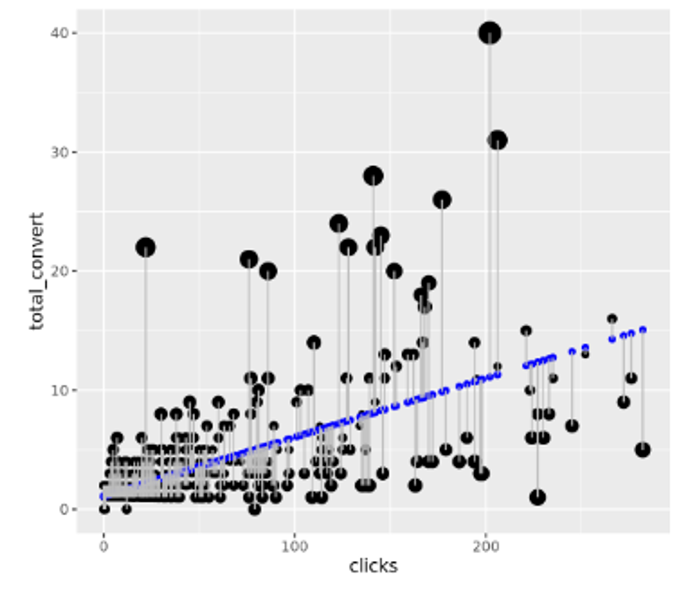

### **LOESS Smoother**

Comparing a linear regression model to a LOESS smoother is one way to visualize where the linear regression model diverges from the training data.

In R, you can visualize a LOESS smoother by adding `geom_smooth(se = FALSE, color = "red")`  to you plot.

In the image, the red line is the LOESS smoother. You’ll see that as the values on the x axis increase, the data starts to diverge from the model.

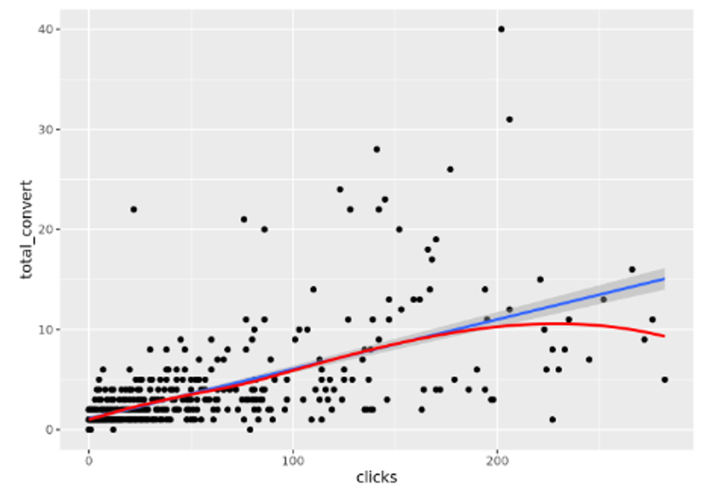

### **Multiple Linear Regression Coefficients**

The interpretation of coefficients in multiple linear regression is different than that of coefficients in simple linear regression. The coefficient of an independent continuous variable represents the difference in the predicted value of the outcome variable for one unit increase in the predictor variable, given that *all* other variables in the model are held constant.

For example, if we made a multiple linear regression model that tried to predict sales based on tv advertisement and podcast advertisement, the coefficient for podcast advertisement would represent the change in the number of sales per one dollar increase in podcast advertisement, assuming tv advertisement was held constant.

### **Simple Linear Regression Coefficients**

When creating a linear regression model using one predictor variable, the regression coefficient represents the difference in the predicted value of the outcome variable for each one-unit increase in the predictor variable.

For example, if we made a simple linear regression model that tried to predict sales based on podcast advertisements, the coefficient for podcast advertisement would represent the change in the number of sales per one dollar increase in podcast advertisement.

# **Conceptual Foundations of Causal Inference**

### **Association vs. Causation**

An association is a relationship between two variables that has a strength or pattern, but is not necessarily causal in nature.

An example of an association is shown in the plot. Because swimming pool sales and forest fires are both high in the summer months (May to August), we might conclude that swimming pools cause forest fires, but really the two variables are similar because they are associated with the heat of summer.

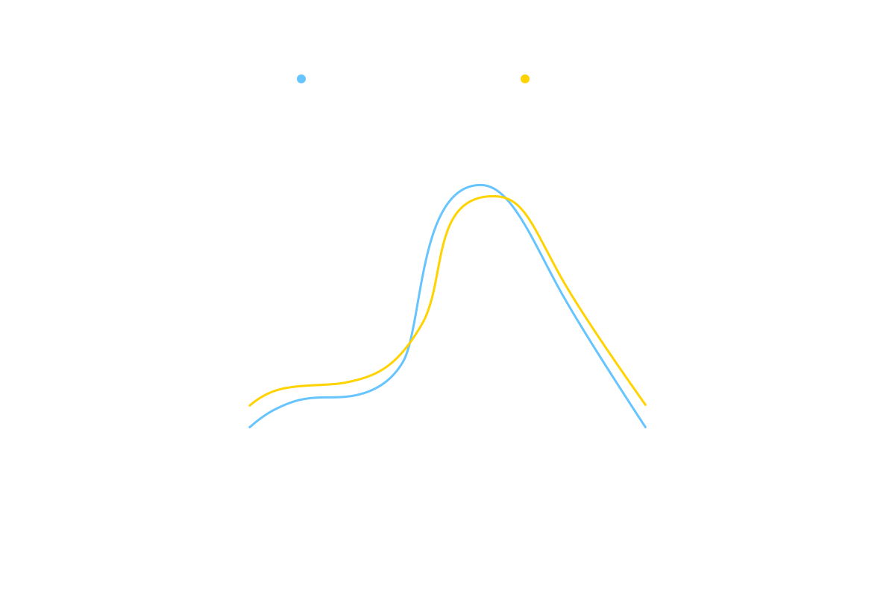

### **Potential Outcomes Definition**

Under the potential outcomes framework for causal inference, potential outcomes are the possible results that could happen under different treatment assignments.

### **Counterfactual Outcomes Example**

Under the potential outcomes framework for causal inference, the observed outcome is what actually happened, while the counterfactual outcome is 
what would have happened had a different treatment been assigned. The included animation shows what the counterfactual outcomes would be when 
an individual is in the treatment group (universe T) and in the control group (universe C).

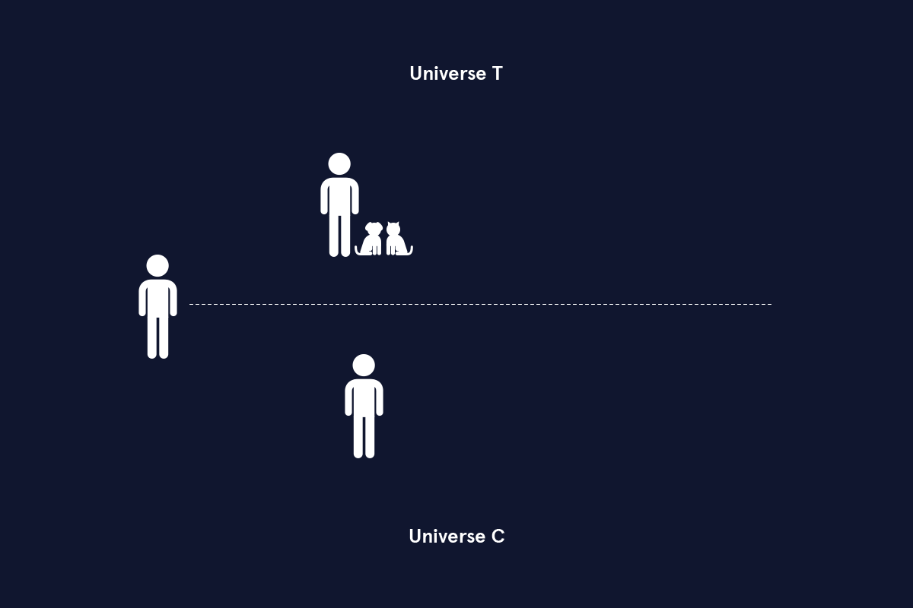

An animation that shows what the counterfactual outcomes would be when an individual is in the treatment group and in the control group. 

In the center of the animation there is a white  horizontal dotted line.

To the left of the dotted line there is a person icon.  Above the line there is the label 'Universe T'. There is an arrow from the central person icon to another person icon with a dog and a cat icon to the right of the person. This arrow is labeled 'Treatment'. To the right of the person with the dog and cat icons there is an arrow pointing right that is labeled 'Outcome' and has the text 'Factual: Universe T' and 'Counterfactual: Universe C' to the right of the outcome arrow. 

The section below the horizontal line is labeled 'Universe C'. There is an arrow pointing from the central person icon to another person icon below the horizontal line. This arrow is labeled 'Control'. To the right of the person icon there is an arrow pointing right labeled 'Outcome' and to the right of the outcome arrow there's the text 'Factual: Universe C' and 'Counterfactual: Universe T., playing

### **Potential Outcomes Notation**

Under the potential outcomes framework of causal inference, we use the following notation to represent the treatment and outcome variables:

- Z: treatment group assignment (1 = treatment, 0 = control)
- Y: outcome actually observed
- $Y^1$  potential outcome given that the individual was in the treatment group $(Z = 1)$
- $Y^0$ potential outcome given that the individual was in the control group  $(Z = 0)$

### **Individual Treatment Effects**

Under the potential outcome framework for causal inference, an individual treatment effect is a comparison of the potential outcomes for a specific individual. One example of an individual treatment effect is Y1 - Y0, where Y1 is the potential outcome if the individual was in the treatment group and Y0 is the potential outcome if the individual was in the control group.

### **Average Treatment Effect**

Under the potential outcomes framework for causal inference, the average treatment effect (ATE) is the average of the individual treatment effects of all individuals in a sample. This can be expressed in two ways:

- average of all differences $Y^1 - Y^0$; or
- average of all $Y^1$ minus the average of all $Y^0$

### **Causal Fundamental Problem**

The fundamental problem of causal inference is that we can never observe both potential outcomes, only the one that actually occurs.

### **Substitutes for Counterfactuals**

In causal inference, when randomization is not possible, we strive to use close substitutes as estimated counterfactuals for our observed outcomes
 in order to find our causal estimand of interest.

### **Confounder Variable Definition**

In causal inference, confounders are variables that are associated with both the treatment status and the outcome. The included image depicts 
how a confounder impacts a causal relationship.

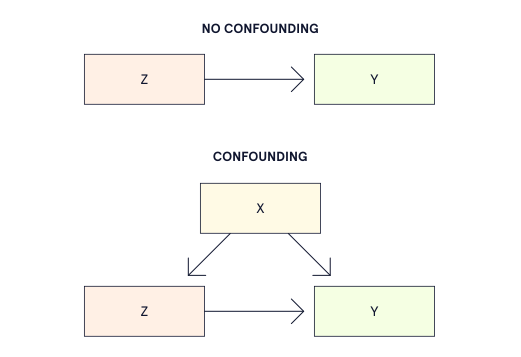

### **Selection Bias Definition**

Selection bias is bias that happens because of how individuals were put into the treatment or control groups. For example, selection bias could occur if 
individuals select which treatment they receive themselves.

### **Conditional Exchangeability Assumption**

The conditional exchangeability assumption of causal inference states that, so long as we account for confounders, we would obtain the same outcomes if the groups swapped treatment assignments. This is also known as the ignorability or unconfoundedness assumption.